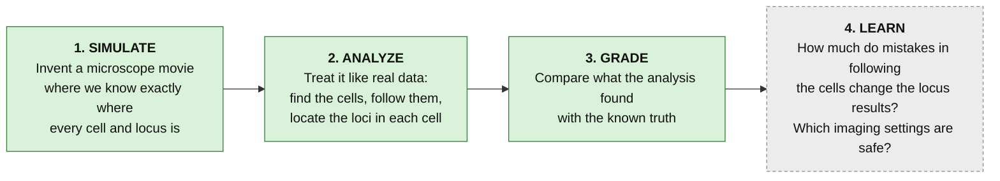
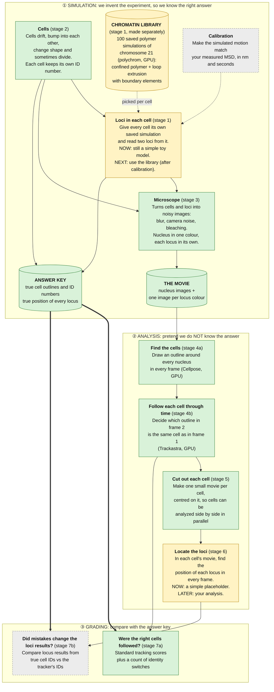
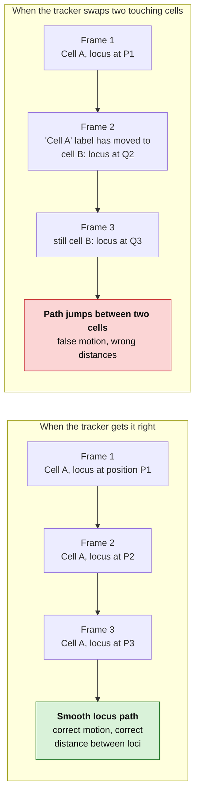
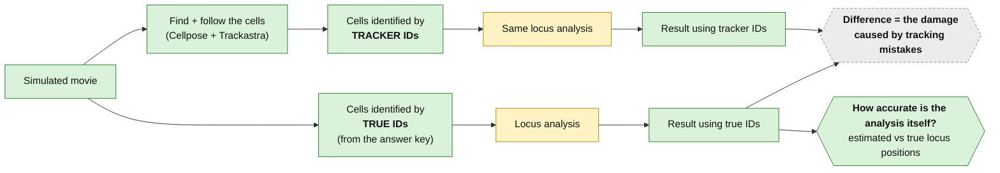

# How this project works

**In one sentence:** we invent a microscope movie where we know exactly where every cell and every locus is, run
our analysis on it as if it were real data, and check how close the analysis gets to the known answer.

Diagrams are [Mermaid](https://mermaid.js.org/); GitHub draws them automatically.

**Colour key:** 🟩 green = built and tested · 🟨 yellow = a simple stand-in that works but will be replaced · ⬜ dashed grey = planned, not built yet

---

## 1. The big idea in four steps

Why simulate? In a real movie nobody knows the right answer. In a simulated one we do, so we can measure
exactly how much each part of the analysis gets wrong.

---

## 2. What happens, step by step

Three zones. **Top:** we build the fake experiment (so we keep an "answer key"). **Middle:** we analyze the movie
while ignoring the answer key. **Bottom:** we grade the analysis against the answer key.

Thick arrows carry the answer key. The analysis zone never sees it; only the grading zone does.
(The chromatin library is simulated on its own, ahead of time, and checked against published Mirny-lab results
([validation report](chromatin_validation.md)). Until each cell is wired to its own saved simulation, the movie pipeline
still uses the toy loci, which need to know when each cell exists, which is why stage 2 feeds stage 1.)

---

## 3. Why we care: what a tracking mistake does to a locus measurement

The tracker has to decide which cell in frame 2 is "the same cell" as in frame 1. When two cells touch, it can get
this wrong. Because every locus is analyzed *inside its cell's own movie*, a wrong decision puts the wrong cell's
locus into that movie.

Stage 7b measures exactly this. We run the same locus analysis twice, once with the true cell IDs and once with the
tracker's IDs, and see how far the results drift apart.

The tracker is also tested twice: once on perfect cell outlines (this isolates its linking mistakes) and once on the
outlines Cellpose finds (the realistic case).

---

## 4. What is built and what comes next

```mermaid
flowchart LR
    subgraph P1["Done"]
        direction TB
        d1["Simulated cells that move,<br/>deform and divide"]:::built
        d2["Realistic microscope images"]:::built
        d3["Cellpose + Trackastra,<br/>scored against the truth"]:::built
        d4["One movie per cell, analyzed<br/>in parallel"]:::built
        d5["Dashboard with players,<br/>parameter scans"]:::built
    end
    subgraph P2["Next: make the loci real"]
        direction TB
        n1["Wire the chromatin library into the movie:<br/>one saved simulation per cell"]:::planned
        n2["Calibrate to your measured<br/>MSD (nm and seconds)"]:::planned
        n3["MS2 bursting, 3D z-stacks,<br/>widefield / spinning-disk / lattice"]:::planned
    end
    subgraph P3["Then: the real question"]
        direction TB
        m1["Plug in YOUR analysis"]:::planned
        m2["Measure how tracking mistakes<br/>change the locus results (7b)"]:::planned
    end
    subgraph P4["Finally: trust it"]
        direction TB
        f1["Compare Ultrack and TrackMate<br/>on the same movies"]:::planned
        f2["Scan cell density and<br/>frame interval, many seeds"]:::planned
        f3["Check against a real,<br/>hand-tracked movie"]:::planned
    end
    P1 --> P2 --> P3 --> P4

    classDef built fill:#d9f2d9,stroke:#2e7d32,color:#111;
    classDef planned fill:#ececec,stroke:#888,stroke-dasharray: 4 3,color:#111;
```

---

## 5. Glossary

| Term | Plain meaning |
|---|---|
| **Locus** | A tagged spot on the DNA that shows up as a bright dot in the image. |
| **Segmentation** | Drawing an outline around every nucleus in an image. |
| **Tracking** | Deciding which outline in the next frame is the same cell. |
| **Identity switch** | The tracker gives a cell a different ID number than it had a frame ago (a swap, or a track that breaks into two). |
| **Ground truth / answer key** | What the simulation knows to be true: real cell outlines, IDs and locus positions. |
| **CHOTA, TRA, DET, LNK** | Standard tracking scores. 1.0 is perfect. CHOTA is the strictest of them. |
| **MSD** | Mean squared displacement: how far a locus typically moves over a given time. Used to calibrate the simulation. |
| **Stand-in** | A simple placeholder that makes the pipeline run end to end until the real piece is built. |

---

## 6. Files each stage reads and writes

Every stage writes its outputs into `data/runs/<run_id>/`, one folder per stage, so any stage can be re-run or
inspected on its own. Each folder also stores the settings used (`params.yaml`), the random seed (`seed.txt`) and the
software versions (`provenance.json`), so a run can always be reproduced.

| Stage | Folder | Main files |
|---|---|---|
| 1 loci (stand-in) | `stage1_chromatin/` | `loci_truth.csv`: true locus positions |
| 2 cells | `stage2_cells/` | `cells.csv`: position, size, shape and ID of every cell in every frame |
| 3 microscope | `stage3_microscopy/` | `nucleus.tif`, `locus0.tif`, `locus1.tif`, `labels.tif` (true cell IDs) |
| 4 find + follow | `stage4_segtrack/` | `tracked_gt_masks.tif`, `tracked_auto_masks.tif`, `tracks_*.csv` |
| 5 cut out cells | `stage5_cells/<who identified them>/` | one folder per cell, plus `cell_summary.csv` |
| 6 locate loci | `stage6_analysis/<who identified them>/` | `loci_positions.csv`, `locus_distances.csv`, `scores.json` |
| 7 grading | `stage7_validation/` | `metrics.json`, `id_switch_events_*.csv` |

"Who identified them" is `truth` (the answer key's IDs), `tracked_gt_masks` or `tracked_auto_masks` (the tracker's IDs).

## 7. What runs where

| Work | Runs on |
|---|---|
| Polymer simulation (planned) | GPU (OpenMM) |
| Finding cells, following cells | GPU (Cellpose, Trackastra), each in its own process |
| Cell motion, image rendering, scoring | CPU |
| Analyzing each cell | CPU, one cell per worker process, all cells at once |
| Dashboard | CPU; the movie players run in your browser |

The one RTX 3090 is shared, so GPU steps run one after another, never at the same time.
