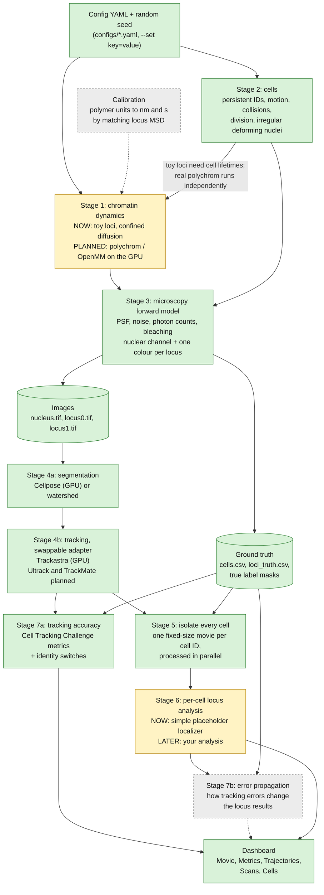
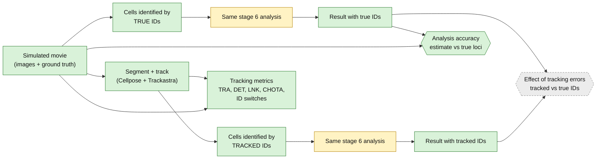
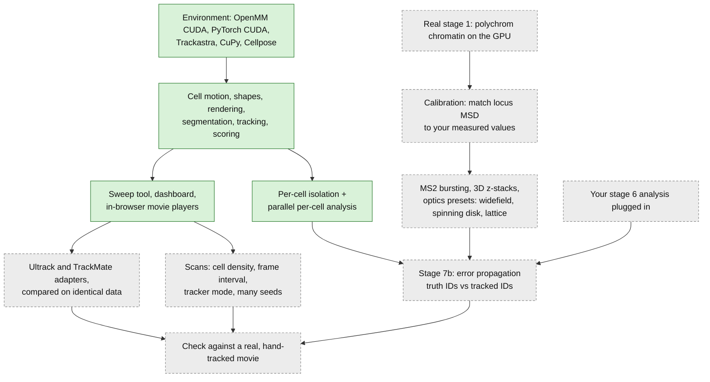

# Architecture and build plan

How the simulation-based validation pipeline fits together, what is built, and what comes next.
(Diagrams are [Mermaid](https://mermaid.js.org/); GitHub draws them automatically. Edit the text to change them.)

**Legend:** 🟩 built and tested · 🟨 stand-in (works, but a placeholder to be replaced) · ⬜ planned, not built

## 1. The pipeline

Every arrow is a set of files on disk (one folder per stage under `data/runs/<run_id>/`). A stage reads the previous
stage's files and writes its own, together with its resolved config, random seed and provenance.

## 2. How the validation works: two identity sources, one analysis

Stage 5 can isolate cells using either the **true** cell IDs or the **tracker's** IDs. The same stage 6 analysis runs
on both, so any difference between the two results is caused by tracking errors alone. Comparing both against the
simulation's true locus positions shows how accurate the analysis is.

Tracking itself is also run twice: on **ground-truth masks** (isolates linking errors) and on **automatic
segmentation** (the realistic case).

## 3. Build roadmap

Boxes are in a sensible build order; arrows mean "needs". Items marked done are in the repository today.

## 4. Files each stage reads and writes

| Stage | Folder in `data/runs/<run_id>/` | Main files |
|---|---|---|
| 1 chromatin (stand-in) | `stage1_chromatin/` | `loci_truth.csv` (true locus positions per cell and frame) |
| 2 cells | `stage2_cells/` | `cells.csv` (position, radius, shape, parent ID per cell and frame) |
| 3 microscopy | `stage3_microscopy/` | `nucleus.tif`, `locus0.tif`, `locus1.tif`, `labels.tif` (true cell IDs) |
| 4 segment + track | `stage4_segtrack/` | `auto_segmentation.tif`, `tracked_gt_masks.tif`, `tracked_auto_masks.tif`, `tracks_*.csv` |
| 5 isolate cells | `stage5_cells/<identity source>/` | `cells/cell_XXXX/{nucleus,locus0,locus1,mask}.tif`, `cell_summary.csv` |
| 6 analysis | `stage6_analysis/<identity source>/` | `loci_positions.csv`, `locus_distances.csv`, `scores.json` |
| 7 validation | `stage7_validation/` | `metrics.json`, `id_matches_*.csv`, `id_switch_events_*.csv` |

Every stage folder also holds `params.yaml` (the resolved config), `seed.txt` and `provenance.json` (git commit and
package versions), so any run can be reproduced from its config and seed. Identity sources: `truth`,
`tracked_gt_masks`, `tracked_auto_masks`.

## 5. Compute

| Work | Runs on |
|---|---|
| Chromatin simulation (OpenMM, planned) | GPU |
| Cellpose segmentation, Trackastra tracking | GPU (in separate processes) |
| Cell motion, image rendering, scoring | CPU |
| Per-cell isolation and analysis | CPU, one cell per worker process |
| Dashboard | CPU; the movie players run in your browser |

The single RTX 3090 is shared, so GPU stages run one after another, never at the same time.
