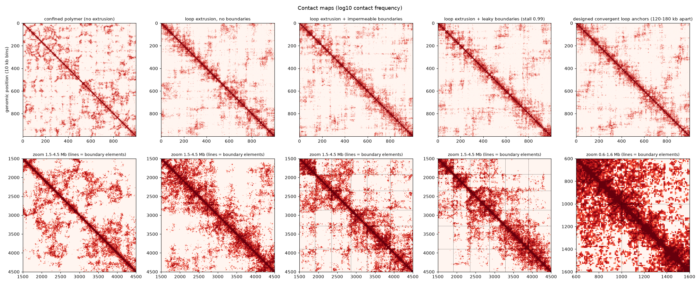
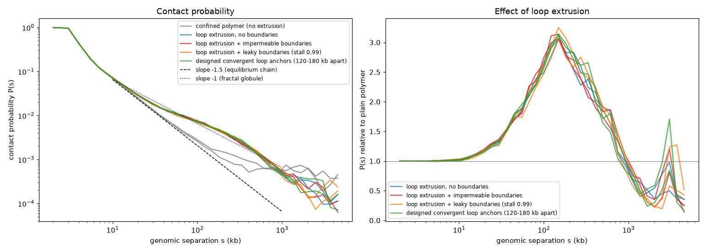
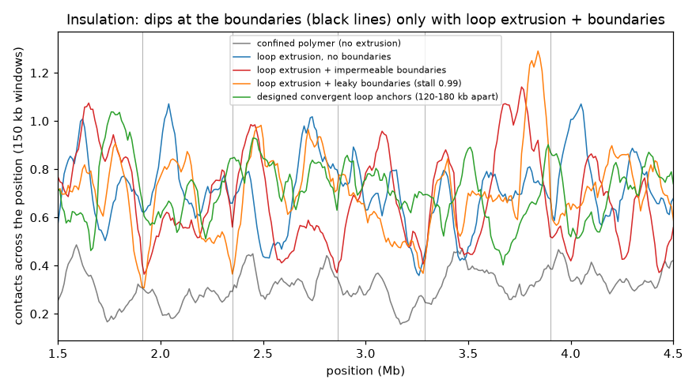
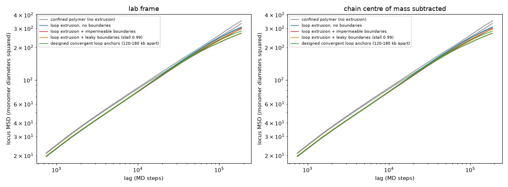

# Chromatin simulation validation

Reproduces published Mirny-lab behaviour with polychrom/OpenMM to verify the chromatin engine before it is used to generate the simulation library. 10 Mb chains (10,000 monomers at 1 kb per monomer), confined in a sphere (density 0.1), 2 independent simulations per condition. Generated by `scripts/validate_chromatin.py`.

**Reference parameters** (polychrom `loopExtrusion` example and Fudenberg et al. 2016, Cell Reports): variable Langevin integrator, harmonic bonds (length 1, wiggle 0.1), angle stiffness 1.5, soft repulsion (trunc 1.5, radius multiplier 1.05), LEF bonds (length 0.5, wiggle 0.2), 750 MD steps per block, LEF separation 120 kb, processivity 200 kb (the paper reports best agreement for ~120-240 kb).

## Results by condition (mean over seeds)

| Condition | P(s) slope 10-100 kb | P(s) slope 100 kb-1 Mb | mean loop (kb) | LEFs at boundaries | insulation fold across boundaries (1 = none) | anchor-pair contact enrichment at the designed loop positions | MSD exponent (COM-subtracted, lags 3-60 blocks) | Rg |
|---|---|---|---|---|---|---|---|---|
| confined polymer (no extrusion) | -1.43 | -0.64 | n/a | n/a | n/a | 0.88 | 0.49 | 21.1 |
| loop extrusion, no boundaries | -0.97 | -1.20 | 113 | n/a | n/a | 0.90 | 0.52 | 20.9 |
| loop extrusion + impermeable boundaries | -0.97 | -1.17 | 101 | 0.14 | 1.36 | 1.10 | 0.51 | 20.9 |
| loop extrusion + leaky boundaries (stall 0.99) | -0.98 | -1.19 | 109 | 0.08 | 1.40 | 0.72 | 0.51 | 20.9 |
| designed convergent loop anchors (120-180 kb apart) | -0.98 | -1.24 | 107 | 0.05 | n/a | 34.67 | 0.51 | 20.9 |

## Checks against known behaviour

| Check | Expected | Measured | Result |
|---|---|---|---|
| Plain polymer P(s) falls steeply with separation | between -1.6 and -0.8 (fractal globule -1, equilibrium chain -1.5) | -1.43 | **PASS** |
| Loop extrusion raises contacts at 50-300 kb (compaction by loops, scale of processivity) | ratio > 1 | 2.83 | **PASS** |
| Loop-extruder bonds actually hold their two legs together in 3D (sanity check on the coupling) | median leg-to-leg distance < 1.5 (bond rest length 0.5; two typical monomers 100 kb apart are ~16 apart) | 0.61 | **PASS** |
| Impermeable boundaries insulate (contacts across borders lower than expected; paper: ~2-fold) | fold >= 1.5 | 1.36 | **CHECK** |
| Without boundary elements the same positions are NOT insulated | fold about 1 (< 1.2) | 1.05 | **PASS** |
| Designed convergent pairs closer than the processivity hold loops part of the time (1D) | anchored fraction between 0.05 and 0.6 (theory for 120-180 kb loops: ~0.1-0.3) | 0.10 | **PASS** |
| ...and the two anchor monomers are in contact far more than a typical pair at that separation (the 'dot') | pooled enrichment >= 3 | 34.67 | **PASS** |
| Same pairs without boundary elements (control) show no enrichment | enrichment < 2 | 0.90 | **PASS** |
| Leaky boundaries (stall 0.99 per attempt) insulate less than impermeable ones | fold between 1.0 and the impermeable value | 1.40 | **PASS** |
| Mean loop size is below the free-LEF processivity (collisions and boundaries shorten loops) | < 200 kb and > 20 kb | 101 | **PASS** |
| Locus motion is sub-diffusive (polymer / Rouse-like) | 0.3 to 0.7 (Rouse 0.5) | 0.49 | **PASS** |
| Contact probability has settled (first vs second half of production) | median |log ratio| < 0.1 | 0.077 | **PASS** |

`CHECK` means the measured value is outside the expected range and needs a closer look (it is not hidden).

## Reading the insulation result

Impermeable boundaries give an insulation fold of 1.36 (per simulation: 1.42, 1.31), against 1.05 for loop extrusion without boundary elements and 0.82, 1.11 for the plain polymer at the same positions. The effect is therefore real, but it is weaker than the >= 1.5 target set before the run and weaker than the roughly 2-fold quoted by Fudenberg et al. (2016). That figure compares contact frequency between TADs with within TADs, which is not the same quantity as the across-position observed/expected fold used here, so the two numbers are not directly comparable. Leaky boundaries (stall 0.99) give 1.40 (per simulation: 1.20, 1.59); with two simulations per condition the seed-to-seed spread (about 0.1-0.2, the same size as the spread of the no-boundary controls) is too large to rank leaky against impermeable boundaries. More simulations per condition would narrow this. The earlier value of about 1.9 came from frozen loops and was an artifact.

## Corrections made to the analysis during validation

0. **A bug in the 3D coupling invalidated the first loop-extrusion validation.** Loop-extruder bonds were moved each block with OpenMM's `updateParametersInContext`, which cannot change which two monomers a bond connects, so the loops stayed frozen at their starting positions (the legs of a loop were as far apart as any two monomers at that separation, ~12 instead of ~0.5). The first results looked plausible because the frozen loops piled up at the boundary sites. It was found while building the time viewer (loop lines crossed the whole nucleus), fixed by pre-registering every bond and switching them on and off as the polychrom example does, and guarded by a GPU regression test plus the leg-distance check below. All loop-extrusion numbers in this report are from simulations re-run after the fix; the old results are kept in `_superseded_static_bonds`. The plain-polymer condition has no loop bonds and was not affected.

The first passes of this validation flagged checks. They turned out to be errors in the *analysis*, not the simulation, and were fixed before the numbers above were produced (stated here so the history is visible):
1. **Insulation metric was biased.** It compared contacts near the diagonal (within a domain) with contacts farther from it (across a boundary), so it gave a ratio of about 6.6 even for the condition with no boundary elements. It now compares at equal genomic separations (observed/expected per diagonal), where 1 means no insulation.
2. **Dot test was badly designed.** Domains averaging 600 kb are larger than the 200 kb processivity, so a LEF rarely reaches both borders and dots are not expected at their corners. Dots are now tested on designed convergent boundary pairs 120-180 kb apart (closer than the processivity), as in the Mirny-lab loop-anchor picture.
3. **Both metrics were then replaced by unbiased ones, chosen on null data.** The within/across ratio was still very noisy (mean 1.5-2.7, sd up to 4.5 at *random* positions). The replacement, contact frequency across a position relative to the expected at that distance, is 1.00 at random positions in the plain polymer and 0.95-0.97 with loop extrusion. A ring-normalised dot metric on 10 kb bins also diluted a single anchor pair 100-fold, so the dot is now the contact probability of the two anchor monomers themselves relative to a typical pair at that separation.
4. **Boundary permeability.** A stall probability of 0.9 per attempt gave NO insulation (a leg retries every step and leaks through in about 10 steps). 0.99 is used for the 'leaky' condition. For libraries, use stall >= 0.99 if visible domain boundaries are wanted.

## Figures

*Contact maps: TAD-like squares and corner dots appear only with loop extrusion and boundaries.*

*Contact probability P(s) and its change relative to the plain polymer.*

*Insulation profile across the region.*

*Locus mean squared displacement versus lag (all tracked beads averaged).*

## Simulation speed

About 3199 MD steps per second for 10,000 monomers on the RTX 3090 (7.8 min per simulation).
